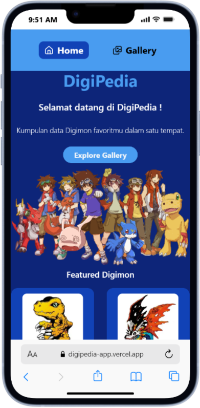
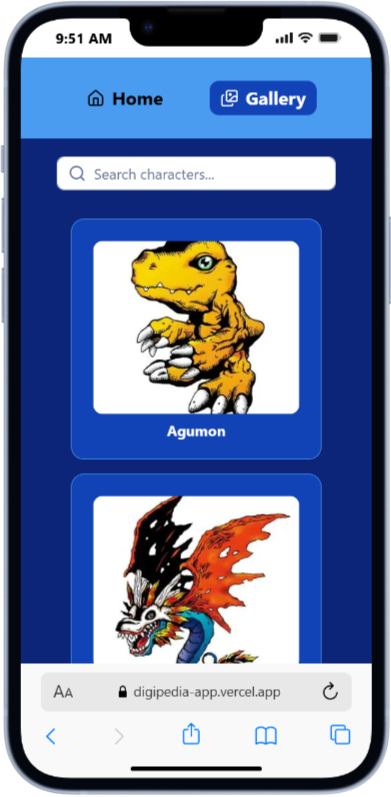
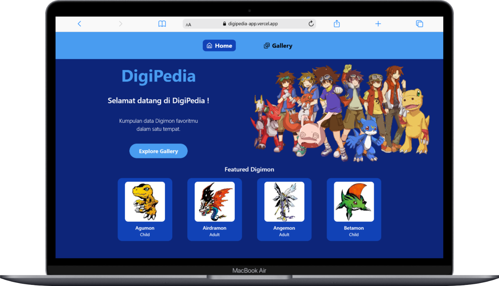
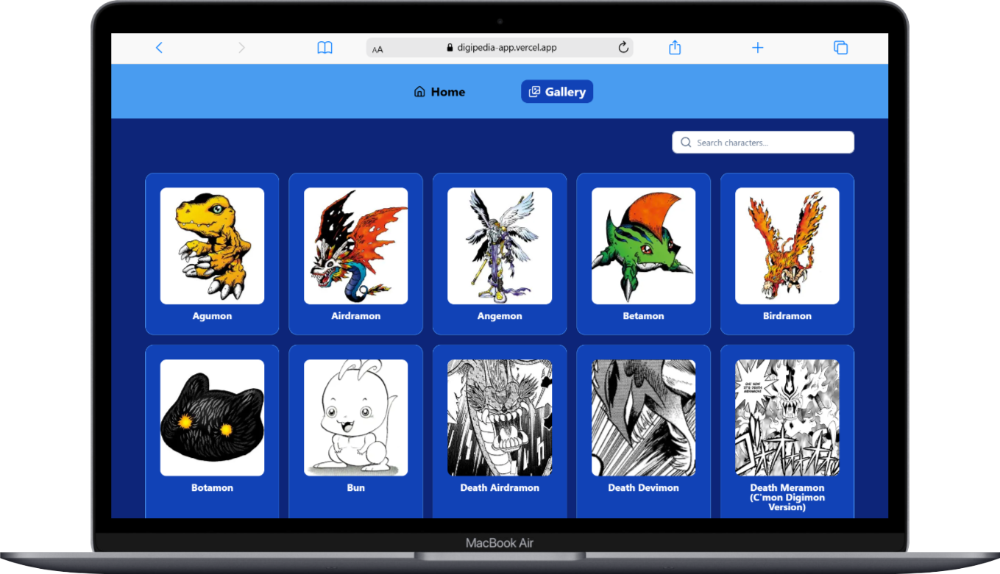

<div id="readme-top" align="center">
  
  <br />
  <h1>Digipedia App</h1>
  <p><em>Explore, Discover, and Evolve Your Digimon Knowledge</em></p>
  <p>
    <a href="https://github.com/fadhillahrmdhn/Digipedia-app/stargazers"></a>
    <a href="https://github.com/fadhillahrmdhn/Digipedia-app/network/members"></a>
    <a href="https://github.com/fadhillahrmdhn/Digipedia-app/issues"></a>
    <a href="http://makeapullrequest.com"></a>
    <a href="https://digipedia-app.vercel.app/"></a>
  </p>

</div>

## Table of Contents

- [Overview](#overview)
  - [Features](#features)
  - [Built With](#built-with)
- [Authors](#authors)
- [Getting Started](#getting-started)
  - [Installation](#installation)
  - [Usage](#usage)

## Overview

**Digipedia-app** is a modern, scalable web platform built with Next.js and React, designed to deliver a rich, interactive Digimon encyclopedia experience.

### Why Digipedia-app?

This project empowers developers to build maintainable, high-performance web applications with a focus on user engagement and seamless data integration.

### Features

- [x] **Real-time Search**: Instant search functionality to find Digimon characters by name
- [x] **Smart Pagination**: Advanced pagination system with ellipsis navigation for large datasets
- [x] **Interactive Gallery**: Grid-based character gallery with hover effects and smooth transitions
- [x] **Detailed Character View**: Modal-based detailed view showing character stats, attributes, types, and descriptions

### Optimal display on desktop and mobile

- Mobile View
<p align="center">
  &nbsp;&nbsp;&nbsp;
  
</p>

- Desktop View
<p align="center">
  &nbsp;&nbsp;&nbsp;
  
</p>

<p align="right">(<a href="#readme-top">back to top</a>)</p>

### Built With

This project was built with the following major frameworks and libraries:

- [![Next][Next.js]][Next-url]
- [![React][React.js]][React-url]
- [![TypeScript][TypeScript]][TypeScript-url]
- [![Tailwind CSS][TailwindCSS]][TailwindCSS-url]
- [![TanStack Query][TanStackQuery.js]][TanStackQuery-url]
- [![Axios][Axios.js]][Axios-url]
- [![Zustand][Zustand.js]][Zustand-url]

<p align="right">(<a href="#readme-top">back to top</a>)</p>

## Authors

This project is developed and maintained by the **Catalyst Team**:

<table >
  <tr>
    <td align="center">
      <a href="https://github.com/fadhillahrmdhn">
        
        <br />
        <sub><b>Fadhillah Ramadhan</b></sub>
      </a>
    </td>
    <td align="center">
      <a href="https://github.com/seriouselly">
        
        <br />
        <sub><b>Selly Supriyatin</b></sub>
      </a>
    </td>
  </tr>
</table>

<p align="right">(<a href="#readme-top">back to top</a>)</p>

## Getting Started

This is an example of how you may give instructions on setting up your project locally. To get a local copy up and running follow these simple example steps.”

### Installation

1.  Clone the repository:
    ```bash
    git clone https://github.com/fadhillahrmdhn/Digipedia-app.git
    ```
2.  Navigate to the project directory:
    ```bash
    cd Digipedia-app
    ```
3.  Install dependencies:
    ```bash
    npm install
    ```

### Usage

To run the development server:

```bash
npm run dev
# or
yarn dev
# or
pnpm dev
# or
bun dev
```

Open [http://localhost:3000](http://localhost:3000) with your browser to see the result.

<p align="right">(<a href="#readme-top">back to top</a>)</p>

<!-- MARKDOWN LINKS & IMAGES -->

[Next.js]: https://img.shields.io/badge/Next.js-000000?style=for-the-badge&logo=nextdotjs&logoColor=white
[Next-url]: https://nextjs.org/
[React.js]: https://img.shields.io/badge/React-20232A?style=for-the-badge&logo=react&logoColor=61DAFB
[React-url]: https://reactjs.org/
[TypeScript]: https://img.shields.io/badge/TypeScript-3178C6?style=for-the-badge&logo=typescript&logoColor=white
[TypeScript-url]: https://www.typescriptlang.org/
[TailwindCSS]: https://img.shields.io/badge/Tailwind_CSS-06B6D4?style=for-the-badge&logo=tailwindcss&logoColor=white
[TailwindCSS-url]: https://tailwindcss.com/
[TanStackQuery.js]: https://img.shields.io/badge/TanStack%20Query-FF4154?style=for-the-badge&logo=reactquery&logoColor=white
[TanStackQuery-url]: https://tanstack.com/query/latest
[Axios.js]: https://img.shields.io/badge/Axios-5A29E4?style=for-the-badge&logo=axios&logoColor=white
[Axios-url]: https://axios-http.com/
[Zustand.js]: https://img.shields.io/badge/Zustand-000000?style=for-the-badge
[Zustand-url]: https://github.com/pmndrs/zustand
